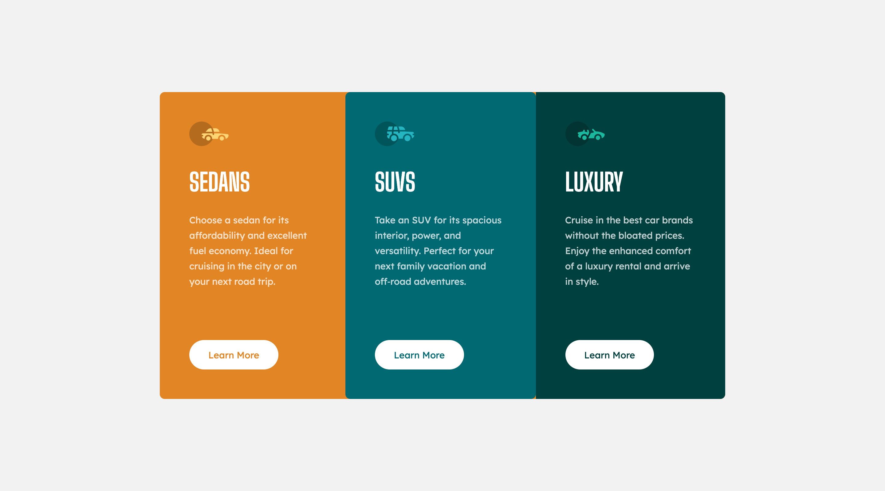
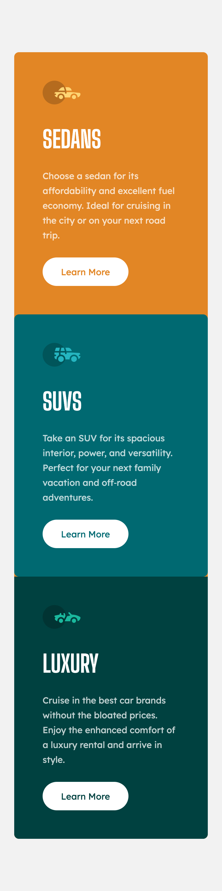

# Frontend Mentor - 3-column preview card component solution

This is a solution to the [3-column preview card component challenge on Frontend Mentor](https://www.frontendmentor.io/challenges/3column-preview-card-component-pH92eAR2-). Frontend Mentor challenges help you improve your coding skills by building realistic projects.

## Table of contents

- [Frontend Mentor - 3-column preview card component solution](#frontend-mentor---3-column-preview-card-component-solution)
  - [Table of contents](#table-of-contents)
  - [Overview](#overview)
    - [The challenge](#the-challenge)
    - [Screenshot](#screenshot)
    - [Links](#links)
  - [My process](#my-process)
    - [Built with](#built-with)
    - [What I learned](#what-i-learned)
  - [Author](#author)

**Note: Delete this note and update the table of contents based on what sections you keep.**

## Overview

### The challenge

Users should be able to:

- View the optimal layout depending on their device's screen size
- See hover states for interactive elements

### Screenshot

### Links

- Solution URL: [Add solution URL here](https://github.com/FocusCookie/fm-3-column-preview-card-component)
- Live Site URL: [Add live site URL here](https://focuscookie.github.io/fm-3-column-preview-card-component/)

## My process

### Built with

- Semantic HTML5 markup
- CSS custom properties
- Flexbox
- CSS Grid
- Mobile-first workflow

### What I learned

In some cases words with hyphens will be break with a line break. In order to avoid this behavior your can use the asci/utf code &#8209; . This hyphen is a none breakable hyphen.

[No Line break after a hyphen](https://stackoverflow.com/questions/7691569/no-line-break-after-a-hyphen)

## Author

- Frontend Mentor - [@FocusCookie](https://www.frontendmentor.io/profile/FocusCookie)
